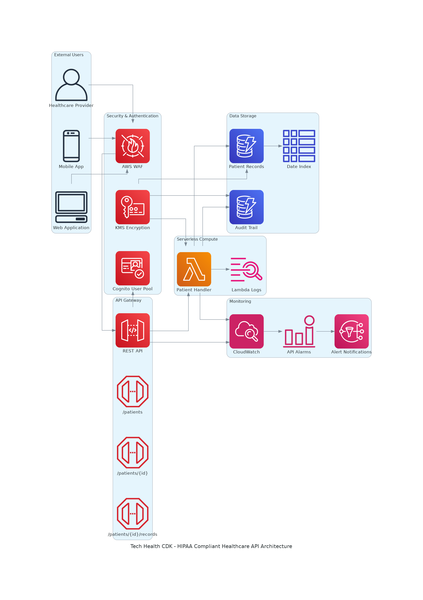

# Tech Health CDK

A production-ready, HIPAA-compliant healthcare API infrastructure built with AWS CDK.

## 🏗️ Architecture

- **API Gateway** with request validation and throttling
- **AWS Lambda** for serverless compute  
- **DynamoDB** with encryption at rest
- **Cognito** for authentication and authorization
- **WAF** for web application firewall protection
- **CloudWatch** for monitoring and alerting
- **KMS** for encryption key management

### Architecture Diagrams



View all architecture diagrams in the [generated-diagrams](generated-diagrams/) directory:
- **Main Architecture**: Complete system overview
- **Data Flow**: Security controls and encryption flow
- **Security Architecture**: HIPAA compliance and threat mitigation

## 🚀 Quick Start

```bash
# Install dependencies
npm install

# Bootstrap CDK (first time only)
cdk bootstrap

# Deploy the stack
npm run deploy
```

## 📋 Scripts

- `npm run build` - Compile TypeScript
- `npm run test` - Run tests
- `npm run deploy` - Deploy to AWS
- `npm run destroy` - Remove from AWS
- `npm run synth` - Generate CloudFormation template

## 🔒 Security Features

- ✅ Encryption at rest and in transit
- ✅ KMS key management with rotation
- ✅ WAF protection with managed rule sets
- ✅ Cognito authentication with MFA
- ✅ IAM least privilege access
- ✅ CloudTrail logging for audit

## 📚 API Endpoints

- `GET /patients` - List patients
- `POST /patients` - Create new patient
- `GET /patients/{id}` - Get patient information
- `PUT /patients/{id}` - Update patient information
- `DELETE /patients/{id}` - Delete patient

## 🏥 HIPAA Compliance

This infrastructure implements HIPAA technical safeguards:

- **Access Control**: Cognito with MFA
- **Audit Controls**: CloudTrail logging
- **Integrity**: Data validation and checksums
- **Transmission Security**: TLS encryption
- **Encryption**: KMS encryption at rest

## 📁 Project Structure

```
├── bin/                    # CDK app entry point
├── lib/                    # CDK constructs and stacks
│   ├── constructs/         # Reusable constructs
│   └── tech-health-cdk-stack.ts
├── lambda/                 # Lambda function code
├── test/                   # Unit tests
├── docs/                   # Detailed documentation
├── generated-diagrams/     # Architecture diagrams
├── screenshots/            # Validation screenshots
└── package.json
```

## 📖 Documentation

- **[Complete Project Documentation](PROJECT_DOCUMENTATION.md)** - Comprehensive guide with architecture, security, and deployment details
- **[API Documentation](docs/API_DOCUMENTATION.md)** - Complete API reference
- **[Architecture Guide](docs/ARCHITECTURE.md)** - Technical architecture details
- **[Deployment Guide](docs/DEPLOYMENT_GUIDE.md)** - Step-by-step deployment instructions
- **[Screenshots Guide](screenshots/README.md)** - Validation screenshots guide

## 📄 License

MIT License
